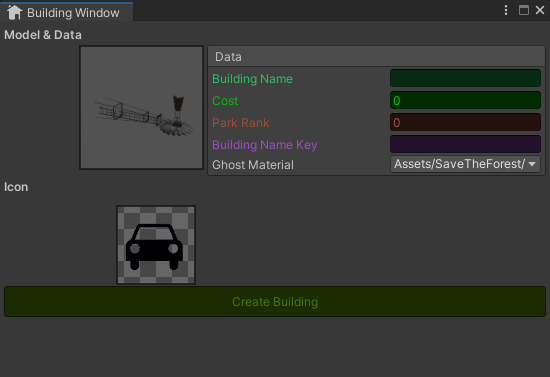

# FRS-Tools Example Tools and Functions used in Forest Ranger Simulator

### Key-Binding System
A new input system was used for the key assignment function. 
To use it, assign a KeyBindingElement to the gameobject and assign values such as:
- _ActionReference: Action Input to change
- _KeyWaitBinding: TextMeshPro where name of key is display
- _BindKeyText: Key to the function name which is displayed as information on the UI 
- _BindingProcess: Key to display text when we binding it's connected with Language Manager
- _KeyForSave: Key to save binding in playerpref
- _BindType: 2 bidning type Button for example M to display map. Composite to working on axis in Unity Input System
- _ButtonImage: button where bidning process have to start
 

 KeyBindingInputManager
  

It is used to control all KeyBindingElement. Saves the state of the default key binding.  Reading the assigned keys. Reading the key bindings stored in playerpref.

### Language Manager
Used as a single data object with text files in which the key and language translations are given. A component with its key is assigned to the TextMeshPro elements and when the OnLanguageChange event is called, the component refers to the Language Manager and reads the value after the key. 
CSVReader is used to read the files.

### Building Tool
A tool for creating buildings for in-game building placement functions. Creates a scriptableobject which serves as the database for a given building, holding values, an icon and 2 gameobjects (a target model and a greenplan). 
The tool creates the greenplan itself from the selected material, removing unnecessary components and adding the component to be controlled when placing it on the stage.

  
   
 Preview BuildingTool
  

### Main Quest

### Attributes
An example of a simple attribute to control the header changing what names and fonts it has only effect in the Unity inspector
